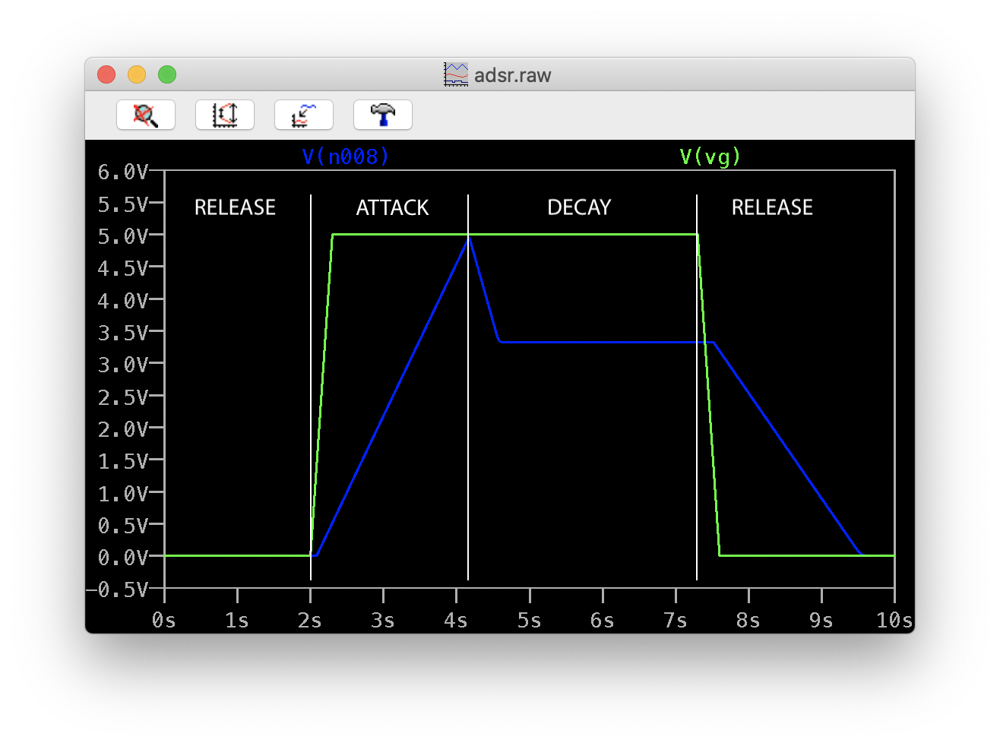

# ADSR Envelope

This circuit operates by using the LM13700 as a variable current source charging
a capacitor. It is configured as a non-inverting op-amp charging the capacitor
to a reference voltage `V_ref` at the `+` pin with a slew rate limited by the current
control. The capacitor's voltage will change linearly based on `I_abc` until it settles
at `V_ref`. Then a bit of digital logic to create a 3-state state machine to select the
correct  `V_ref` and `I_abc`.

States:

- Attack: `V_gate=5V`, `V_ref=V_in`, `I_abc` controlled by `R_attack`
- Decay: `V_gate=5V`, `V_ref=V_sustain`, `I_abc` controlled by `R_decay`
- Release: `V_gate=0`, `V_ref=0`, `I_abc` controlled by `R_release`

The Attack, Decay, and Release knobs control `I_abc` in each state,
while the Sustain knob divides down `V_in` to set `V_ref` in the
Decay state.

A comparator, capacitor, and a few transistors create cheap analog
a flip-flop that turns on when the output hits `V_in` (flipping from
the Attack state to the Decay state), and turns off when `V_gate`
turns off.

Voltage control of the parameters could be possible by exposing
access to `I_abc`, but it doesn't make much sense to me to expose
those parameters with any control other than a knob - it's not the
kind of thing you need to modulate automatically.

Choice of the capacitor and the knob resistance control the time
range. Large values for both mean a longer charge time, but a large
capacitance effects the fastest charge time too, since `I_abc` is
capped at 2mA.

**TODO: power usage** 
