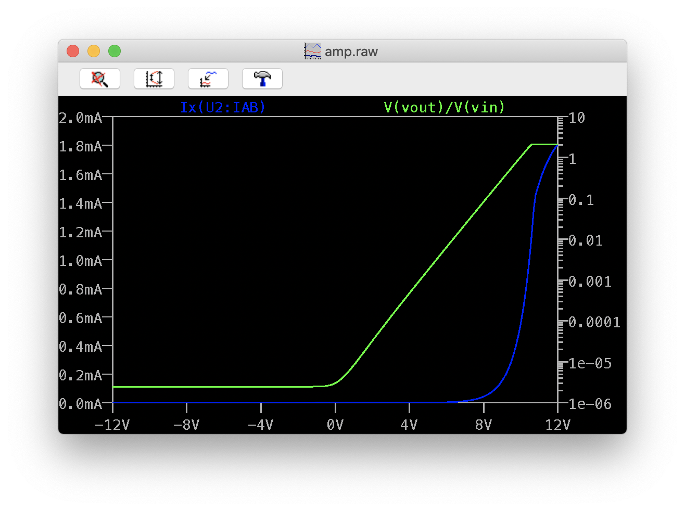

# VCA

> 4-channel amplifier

## Description

Control Voltage 0-10V with `10V -> Gain=1`, `0V -> Gain~=0`. Can be overdriven up to `11V -> Gain=2` (actually slightly less because it will clip). Output is about 9.2 dB/V, with 0V around -98 dB.

Control voltage inputs are summed with a control knob, which adjusts CV between 0V and 10V.

The 4 channels are connected to the 4 channels from the filter, unless an input is supplied.

The 4 channels are mixed down along with EXT-IN, an input for arbitrary external signals, such as those from another synth. In MIX mode, the result of the mix is sent to both left and right stereo outputs. in SPLIT mode, channels A and C go to the left channel output only, while B and D go to the right channel output only.

Both 1/4" TLS main and 3.2mm headphone outputs are available. **TODO: power calculation**

**TODO: power usage** 

## Design

The amplifier is designed around the [LM13700](../reference/datasheets/lm13700.pdf), with an [antilog converter](../reference/exponential.pdf) providing current control. Calculations of component values are [here](amp.xlsx).

The LM13700 acts as a linear amplifier when `Vd <= 20mV`. It's output is a current source given by the equation `Iout=0.5*Vd/Vt*Iabc` where `Vt=26mV` @ room temp. `Iabc` cannot exceed 2mA. Setting `Iabc=0.5mA` for unity gain puts `Iout=.192mA`. This can be converted back to a voltage with a resistor. `Rout=26kΩ `sets the overall voltage gain to unity.

## Tuning

1. Set CV-IN to 10V, and RV2 to completely off. Adjust RT1 until base of Q1A is 0V (or Q1 collectors are the same).
2. Set CV-IN to 0V, and RV2 to completely on. Adjust RT2 until the current through it is 0.5mA.
3. Set CV-IN to 0V, RV2 to completely on, and IN to 10V. Adjust RT3 until OUT is 10V (an overall gain of 1).
