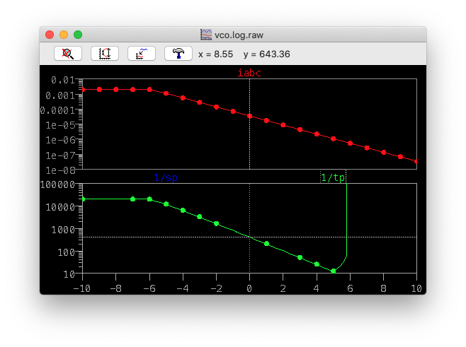

Here, the frequency measurement flies off to infinity after 5V that's because the frequency has gotten too low to fit in the `.tran` time window. Increasing the time window wide enough to measure the frequency up to CV=10V causes the simulation to timeout. However, the exp. converter remains accurate to 3 decades below 0V, which is hypothetically CV=20V -> A-16 (f=419mHz or a period of \~40 seconds). The power supply max at CV=12 would be A-8 for a period of 9.8s.

Rref was calculated to be 341K but imperically determined from LTSpice model to be 326K. A trim pot should allow precision tuning.

Accurracy seems to be dependant on min/max opamp output voltages. Might be good to invest in a real rail-to-rail comparator or use offset-null of TL071.

High-freq error seems to be from comparator slew rate. TL07X slew rate is roughly 13V/us (under best circumstances). At 14.08KHz, the period is \~71us, and it's got to travel 8.2V in two directions. That means 1.8% error right there.

From the simulation, the slew rate at 14.08KHz seems to be 3.8V/us, for an error of 6.2%, which is a bit closer to the measured 14%.

The LM311 datasheet claims a slew rate of up to 50V/us, equating to a \~0.5% error.
